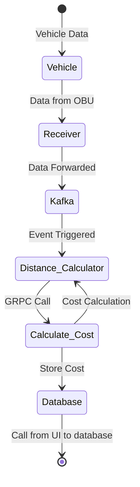

# RedHat-Openshift-Hackathon-Project

## Toll Microservice


## Project Overview

The Toll Microservice project is a part of the RedHat-Openshift-Hackathon-Project. It is designed to calculate distances and costs for vehicles equipped with On-Board Units (OBUs). This system comprises several microservices that work together in a distributed architecture to process vehicle data.

## Features

- **Calculate Distance:** Determine the distance covered by a vehicle between two geographical points (start and destination) using latitude and longitude coordinates.
- **Calculate Costs:** Calculate the cost of a journey based on the distance covered, using a predefined price.
- **Event-Driven:** Utilizes Kafka, an event-based system, for real-time data processing and messaging.

## Architecture

The Toll Microservice system is composed of the following microservices:

1. **Receiver Microservice**: Accepts OBU ID, latitude, and longitude data and forwards it to the Kafka event stream.

2. **Kafka**: Serves as an event-driven message queue for asynchronous data processing.

3. **Distance Calculator Microservice**: Consumes data from Kafka, calculates the distance between start and destination points, and makes a GRPC call to a cost calculation microservice.

4. **Cost Calculation Microservice**: Receives GRPC calls from the Distance Calculator Microservice and computes the cost based on the distance.

5. **Database**: Stores the calculated data, including OBU ID, distance, and cost.

The architecture ensures modularity and scalability in processing vehicle data efficiently.

## System Flow

The following state diagram illustrates the flow of the Toll Microservice project:



## Setting up the Project

To set up the Toll Microservice project, follow these steps:

1. Clone the repository.

   ```bash
   git clone https://github.com/Pankaj-SinghR/RedHat-Openshift-Hackathon-Project
   ```

2. Install the necessary dependencies.

   ```bash
   cd toll_microservice
   ```

   ```bash
   cd ..
   cd obu
   npm install
   ```

3. Run the microservices locally for development.

   ```bash
   docker-compose up --build -d
   ```

4. Run the frontend

   ```bash
   cd frontend
   npm install
   npm run dev
   ```

## Populating Data

Before you can use the Toll Microservice, you'll need to populate it with data, including OBU IDs, starting and ending latitude and longitude, total distance, and total price. This can be done using the `obu.js` script. Here's how to do it:

Make sure your microservices are up and running using Docker Compose:

```bash
docker-compose up --build -d
```

1. Navigate to the obu directory:

   ```bash
   cd obu
   ```

2. Use the obu.js script to add data for your OBUs. You can modify the script to add as many entries as you need:

   ```bash
   node obu.js
   ```

   The script will populate the system with OBU data, including OBU IDs, starting and ending coordinates (latitude and longitude), total distance, and total price.

3. Once the data is populated, you can start using the microservices to calculate distances and costs based on the provided OBU data.
