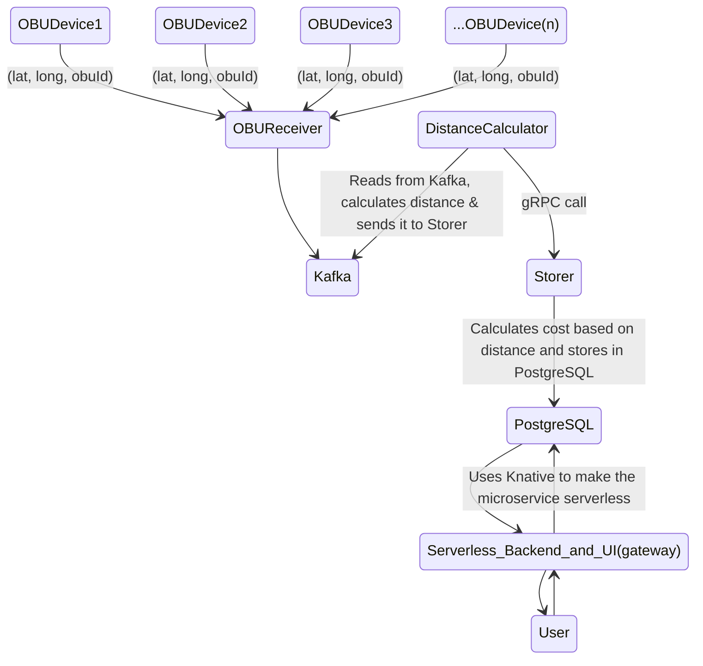

# RedHat-Openshift-Hackathon-Project

## Toll Microservice


## Project Overview & Architecture
The **Toll Microservice** is a comprehensive solution designed to efficiently manage and calculate toll costs for vehicles equipped with **On-Board Units (OBU)** while providing **real-time tracking of their positions and toll expenses**. This microservice system streamlines the process from OBU data collection to toll calculation and presentation through a user-friendly interface.

1. **OBU Receiver Server**:
   - Listens for location data from OBU devices and publishes it to the Kafka stream for further processing.
   - **Tools & Technology**: Custom server, Kafka

2. **Kafka Stream**:
   - Acts as an event stream for real-time data processing, facilitating the flow of location data.
   - **Tools & Technology**: Apache Kafka

3. **Distance Calculator Microservice**:
   - Calculates the distance covered by vehicles between location updates and communicates with the Storer Microservice for toll calculations.
   - **Tools & Technology**: Custom microservice, gRPC

4. **Storer Microservice**:
   - Receives distance data and OBU IDs, calculates toll costs, and stores the information in a PostgreSQL database.
   - **Tools & Technology**: Custom microservice, PostgreSQL

5. **Gateway Microservice**:
   - Offers a user-friendly interface and APIs for tracking OBU devices, viewing locations, distances, and toll costs.
   - **Tools & Technology**: Custom serverless microservice, Knative, React JS


   
## Problem Solving
1. **Automated Toll Calculation**: The system automates the calculation of toll costs based on the distance covered by vehicles. This eliminates manual toll calculations, reducing the risk of errors and ensuring accurate billing.
2. **Real-time Tracking**: The microservice allows for real-time tracking of OBU-equipped vehicles, providing location updates and toll costs to users. This ensures transparency and improves fleet management.
3. **Scalability**: The use of serverless architecture with Knative for the Gateway Microservice ensures that the system can easily scale to handle a large number of OBU devices without the need for manual intervention.
4. **Efficient Data Processing**: By utilizing Kafka for event-driven processing, the system efficiently processes location data, calculates distances, and computes toll costs, ensuring low-latency responses.
5. **User-Friendly Interface**: The Gateway Microservice provides a user interface and APIs that allow users to view OBU device locations, distances traveled, and toll costs in a simple and intuitive manner.


## Setting up the Project in Openshift cluster using helm chart

To set up the Toll Microservice project, follow these steps:

1. Clone the repository.

   ```bash
   git clone https://github.com/Pankaj-SinghR/RedHat-Openshift-Hackathon-Project
   ```

2. Install the necessary dependencies.

   ```bash
   cd toll_microservice
   ```

   ```bash
   cd ..
   cd obu
   npm install
   ```

3. Run the microservices locally for development.

   ```bash
   docker-compose up --build -d
   ```

4. Run the frontend

   ```bash
   cd frontend
   npm install
   npm run dev
   ```

## Populating Data

Before you can use the Toll Microservice, you'll need to populate it with data, including OBU IDs, starting and ending latitude and longitude, total distance, and total price. This can be done using the `obu.js` script. Here's how to do it:

Make sure your microservices are up and running using Docker Compose:

```bash
docker-compose up --build -d
```

1. Navigate to the obu directory:

   ```bash
   cd obu
   ```

2. Use the obu.js script to add data for your OBUs. You can modify the script to add as many entries as you need:

   ```bash
   node obu.js
   ```

   The script will populate the system with OBU data, including OBU IDs, starting and ending coordinates (latitude and longitude), total distance, and total price.

3. Once the data is populated, you can start using the microservices to calculate distances and costs based on the provided OBU data.
