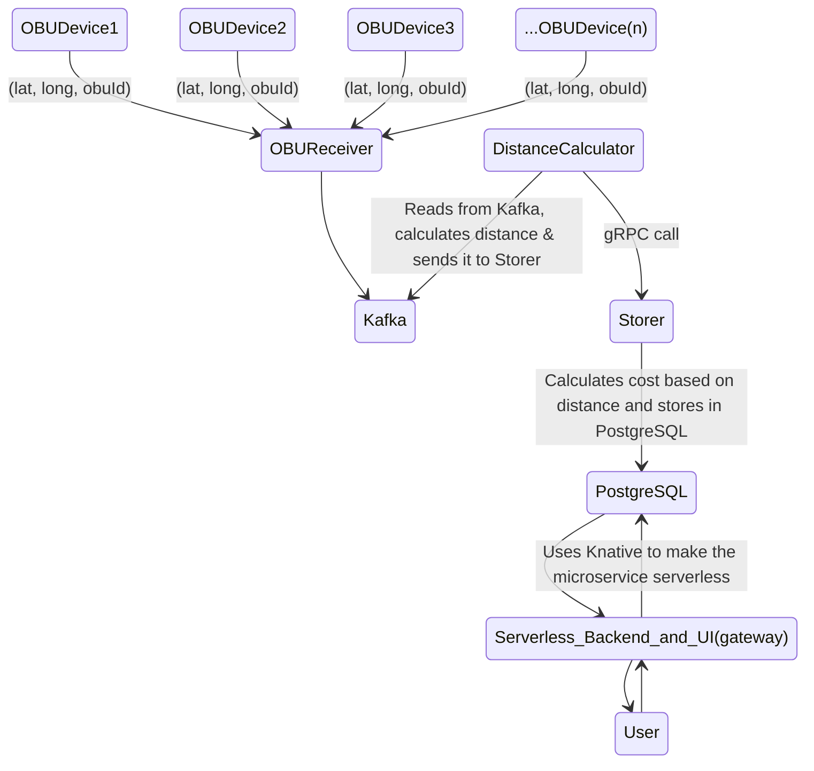
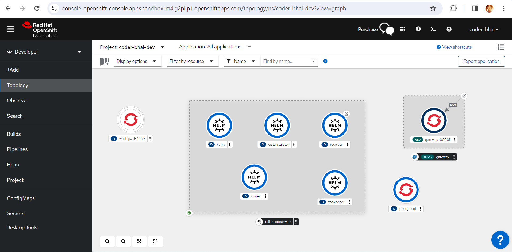
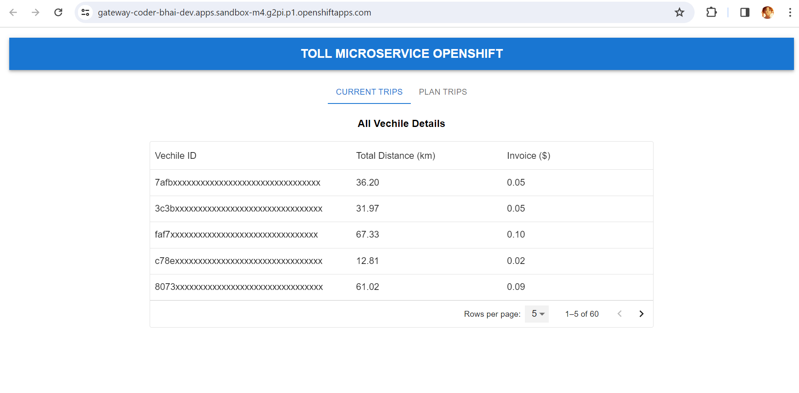
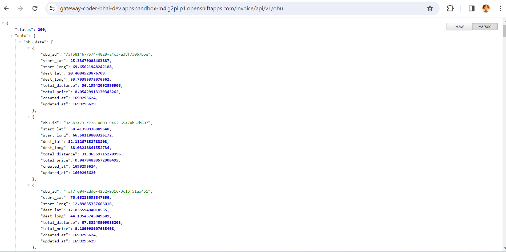

# RedHat-Openshift-Hackathon-Project

## Toll Microservice


## Project Overview & Architecture

The **Toll Microservice** is a comprehensive solution designed to efficiently manage and calculate toll costs for vehicles equipped with **On-Board Units (OBU)** while providing **real-time tracking of their positions and toll expenses**. This microservice system streamlines the process from OBU data collection to toll calculation and presentation through a user-friendly interface.

1. **OBU Receiver Server**:
   - Listens for location data from OBU devices and publishes it to the Kafka stream for further processing.
   - **Tools & Technology**: Custom server, Kafka

2. **Kafka Stream**:
   - Acts as an event stream for real-time data processing, facilitating the flow of location data.
   - **Tools & Technology**: Apache Kafka

3. **Distance Calculator Microservice**:
   - Calculates the distance covered by vehicles between location updates and communicates with the Storer Microservice for toll calculations.
   - **Tools & Technology**: Custom microservice, gRPC

4. **Storer Microservice**:
   - Receives distance data and OBU IDs, calculates toll costs, and stores the information in a PostgreSQL database.
   - **Tools & Technology**: Custom microservice, PostgreSQL

5. **Gateway Microservice**:
   - Offers a user-friendly interface and APIs for tracking OBU devices, viewing locations, distances, and toll costs.
   - **Tools & Technology**: Custom serverless microservice, Knative, React JS

---



---

## Problem we tried to solve

1. **Automated Toll Calculation**: The system automates the calculation of toll costs based on the distance covered by vehicles. This eliminates manual toll calculations, reducing the risk of errors and ensuring accurate billing.
2. **Real-time Tracking**: The microservice allows for real-time tracking of OBU-equipped vehicles, providing location updates and toll costs to users. This ensures transparency and improves fleet management.
3. **Scalability**: The use of serverless architecture with Knative for the Gateway Microservice ensures that the system can easily scale to handle a large number of OBU devices without the need for manual intervention.
4. **Efficient Data Processing**: By utilizing Kafka for event-driven processing, the system efficiently processes location data, calculates distances, and computes toll costs, ensuring low-latency responses.
5. **User-Friendly Interface and Open API's**: The Gateway Microservice provides a user interface and APIs that allow users to view OBU device locations, distances traveled, and toll costs in a simple and intuitive manner.

---

## Instructions for Deployment of microservice

### Prerequisite

1. ##### Should have redhat developer account for openshift

2. ##### Should have following tools installed in local machine

   - **oc cli** (openshift command line interface) to interact with openshift cluster.  [Install oc CLI](https://docs.openshift.com/container-platform/4.8/cli_reference/openshift_cli/getting-started-cli.html)
   - **helm cli** to deploy all microservice using helm chart.  [Install helm](https://helm.sh/docs/intro/install/)
   - **docker and docker-compose** (if wants to run all microservice in local environment only)
   - **nodejs should be installed** (cuz the code which replicate the obu id's is written in nodejs). [Install nodejs](https://nodejs.org/en/download)

## Setting up the Project in Openshift cluster using helm chart

To set up the Toll Microservice project, follow these steps:

1. **Login to openshift cluster using oc cli `use any method you like to login`**

   ```bash
   oc login --token=<REPLACE WITH YOUR TOKEN> --server=<REPLACE WITH YOUR OPENSHIFT CLUSTER URL>
   ```

2. **Create a postgresql pod in the openshift cluster using `oc new-app` command (recommended : let password be mypassword)**

   ```
   oc new-app --name=postgresql -e POSTGRESQL_ADMIN_PASSWORD=mypassword postgresql:10-el8
   ```

   `check if postgres pod running or not`

      ```
      oc get pods
      ```

- **output**

   ```
   NAME                         READY   STATUS    RESTARTS   AGE
   postgresql-5ddb5fcc8-zsjgm   1/1     Running   0          26s
   ```

3. **Clone the repository and list the directory.**

   ```
   git clone https://github.com/Pankaj-SinghR/RedHat-Openshift-Hackathon-Project && cd RedHat-Openshift-Hackathon-Project && ls -l
   ```

- **output**

   ```bash
   total 12
   -rwxrwxrwx 1 dev dev 1069 Nov  6 22:08 LICENSE
   -rwxrwxrwx 1 dev dev 4963 Nov  6 22:08 README.md
   drwxrwxrwx 1 dev dev 4096 Nov  6 22:08 helm
   drwxrwxrwx 1 dev dev 4096 Nov  6 22:08 toll_microservice
   ```

   **Note**
   `helm directory contains all the yaml file for deployment, service, routes and knative service with their values.yml file and toll_microservice contains all the microservice with their respective code`

   `All the images used for deployment of each microservice has already been build and pushed to quay.io image registry`

  - [OBU Receiver Registry](https://quay.io/repository/coder_bhai/receiver)
  - [Distance Calculator Registry](https://quay.io/repository/coder_bhai/distance_calculator)
  - [Storer Registry](https://quay.io/repository/coder_bhai/storer)
  - [API Gateway Registry](https://quay.io/repository/coder_bhai/gateway)

4. **Deploy all microservice using `helm install` command**

   ```
   helm install toll-microservice helm/helm 
   ```

5. **Check all the pods, routes and knative serverless microservices**

   ```
   oc get pods
   ```

- **output** Hurray, all microservice got successfully deployed

   ```bash
      NAME                                        READY   STATUS    RESTARTS   AGE
      distance-calculator-54d78cb6d-p78g6         1/1     Running   0          43s
      gateway-00001-deployment-57d846fb57-jkhj8   2/2     Running   0          43s
      kafka-8559d7d4df-p4m6q                      1/1     Running   0          43s
      postgresql-5ddb5fcc8-zsjgm                  1/1     Running   0          20m
      receiver-56c775685f-p57v5                   1/1     Running   0          43s
      storer-bb795778-tztbv                       1/1     Running   0          43s
      zookeeper-5d7d58dd6f-zx7kf                  1/1     Running   0          43s
   ```

---

###### Screenshot of deployed microservice in openshift cluster



   ```
   oc get routes
   ```

- **output**

  `receiver-coder-bhai-dev.apps.sandbox-m4.g2pi.p1.openshiftapps.com is route exposes by OBU receiver microservice for OBU devices to connect and send data`

   ```bash
   NAME                   HOST/PORT                                                                       PATH   SERVICES               PORT          TERMINATION          WILDCARD
   primer-export-primer   primer-export-primer-coder-bhai-dev.apps.sandbox-m4.g2pi.p1.openshiftapps.com          primer-export-primer   oauth-proxy   reencrypt/Redirect   None
   receiver               receiver-coder-bhai-dev.apps.sandbox-m4.g2pi.p1.openshiftapps.com                      receiver               8080                               None
   ```

   ```
   oc get ksvc
   ```

- **output**
 `https://gateway-coder-bhai-dev.apps.sandbox-m4.g2pi.p1.openshiftapps.com is serverless microservice URL using knative exposing UI and backend api to internet. Hit the URL and you'll get UI to interact`
 `Try accessing /invoice/api/v1/obu to get all OBU data or /invoice/api/v1/obu/:OBUId to get only a particular obu data (replace OBUId with some OBU Id you interested in.)`

   ```bash
   NAME      URL                                                                        LATESTCREATED   LATESTREADY     READY   REASON
   gateway   https://gateway-coder-bhai-dev.apps.sandbox-m4.g2pi.p1.openshiftapps.com   gateway-00001   gateway-00001   True
   ```

6. **Try publishing data to OBU Server**

- **Move to obu directory in toll_microservice**

   ```
    cd toll_microservice/obu && ls -l
   ```

  - **output**

   ```bash
   -rwxrwxrwx 1 pankaj pankaj  1720 Nov  6 20:02 obu.js
   -rwxrwxrwx 1 pankaj pankaj   245 Nov  6 18:38 package.json
   ```

- **Install dependencies**

   ```
    npm i
   ```

- **send data to obu receiver microservice** `replace <EXPOSED ROUTE> with the url you got for exposing your OBU receiver microservice in my case it's receiver-coder-bhai-dev.apps.sandbox-m4.g2pi.p1.openshiftapps.com`

   ```
    node obu.js --url ws://<EXPOSED ROUTE>:8080/ws --obu 10 
   ```

  - **output**
   `This will generate multiple OBU Devices and send their latitude and longitude in interval of 5sec. Otherside, you can check in UI or check in api`

   ```bash
   Connected to OBU server
   {"OBUId":"7afb8146-7b74-4828-a4c3-a38f73067bbe","Lat":25.336789323582625,"Long":69.65622209979807}
   {"OBUId":"3c3b2a73-c726-4009-9e62-65e7ab37b607","Lat":58.41350852993055,"Long":66.58110796729981}
   {"OBUId":"c78ed829-5f8b-492c-8fcb-e73fa5646910","Lat":88.50572726697783,"Long":39.141666310043334}
   {"OBUId":"b878173c-6d4d-4cb8-8c9e-2b7e4c0558e3","Lat":50.477693525913814,"Long":37.50985811388098}
   {"OBUId":"8073e852-b526-4102-adeb-d0c0980b662e","Lat":98.501814324035,"Long":61.903717667737546}
   {"OBUId":"f922c84d-8657-48a1-b8b3-75c5890bb9c7","Lat":99.87128077126462,"Long":33.09932326325118}
   {"OBUId":"faf7fe04-2dde-4252-9316-3c13f51ea451","Lat":76.65223501388608,"Long":12.898353684376666}
   {"OBUId":"2a4fab66-5e3d-4df0-a929-65693b918e8b","Lat":50.940055056921835,"Long":75.99938506555429}
   {"OBUId":"c312d6e4-f336-40fd-8755-426357956e96","Lat":8.49041594455429,"Long":82.95116847517987}
   {"OBUId":"b4ca33c4-6a9b-466b-ad6b-b7c589b26e67","Lat":19.874382473923212,"Long":45.878200293193544}
   ```

#### Screenshot of simple UI



#### Screenshot of public api



## Setting up the Project in local environment using docker-compose

1. **Clone the repository and list the directory.**

   ```
   git clone https://github.com/Pankaj-SinghR/RedHat-Openshift-Hackathon-Project && cd RedHat-Openshift-Hackathon-Project && ls -l
   ```

2. **Change directory to toll_microservice.**

   ```
   cd toll_microservice
   ```

3. **use docker-compose command to bulid and run all microservice**

   ```
   docker-compose up --build -d
   ```

   - **output**

   ```bash
      Creating toll_microservice_gateway_1   ... done
      Creating toll_microservice_gateway_1             ... done
      Creating toll_microservice_storer_1    ... done
      Creating toll_microservice_kafka_1     ... done
      Creating toll_microservice_distance_calculator_1 ... done
      Creating toll_microservice_receiver_1            ... done
   ```

4. **use step 6 of helm deployment to publish data to localhost:8080 OBU receiver**

   ```
   node obu.js
   ```
